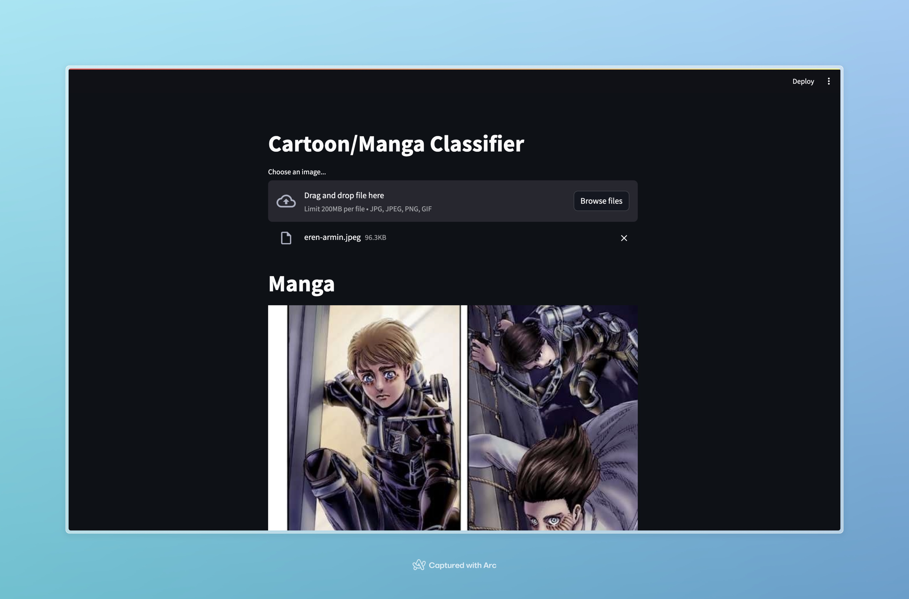

# Cartoon/Manga Classifier

This classifier is designed to categorize images into either the 'cartoon' or 'manga' classes based on their characteristics and visual features.



[Dataset (Google Drive)](https://drive.google.com/drive/folders/1TSVH7UmEyFkv-qzOF9F_rsYP1WxVIKez?usp=drive_link)


[Live Demo - https://cartoon-manga-classifier.rajatjacob.com](https://cartoon-manga-classifier.rajatjacob.com)

## Usage

1. Install dependencies: `pip install -r requirements.txt`
2. Run the web server

```sh
cd app
streamlit run app.py
```

To redownload the training data, you can run the downloader script:
```sh
python3 download_images.py
```

## Demonstration video

[](https://www.youtube.com/watch?v=nqEnL34_abU)
